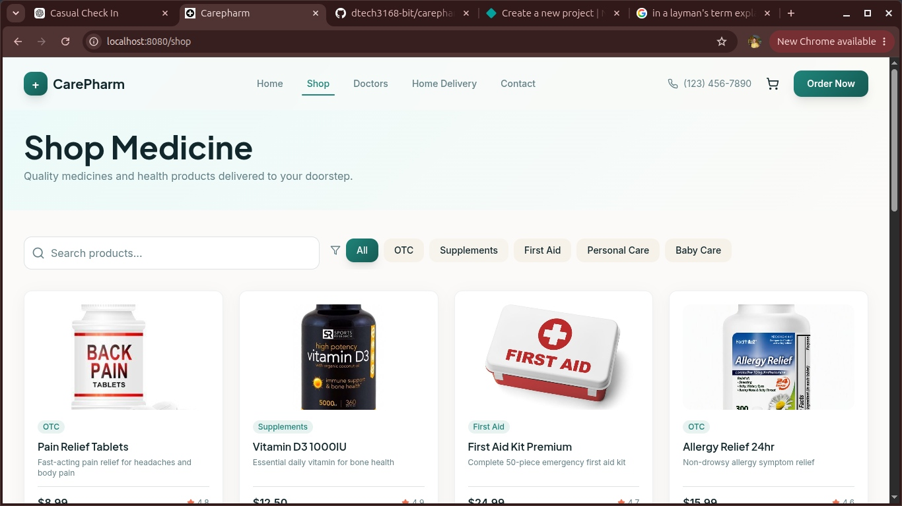
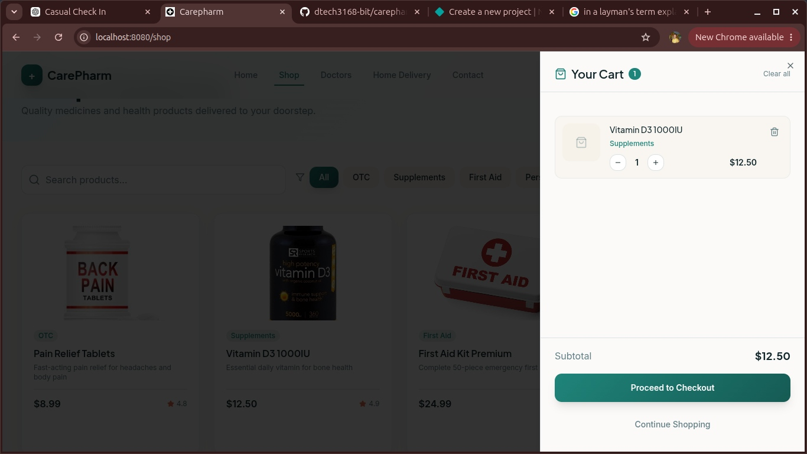

# CarePharm

CarePharm is a modern pharmacy e-commerce frontend built with React and TypeScript. It provides a responsive shopping experience for browsing healthcare products and accessing pharmacy-related services.

## Live Demo
https://your-live-url.com

## Screenshots

### Homepage


### Product Catalogue



### Shopping Cart



## Features

- Responsive pharmacy storefront
- Product catalogue
- Product categories
- Product search/filtering
- Shopping cart interface
- Healthcare service sections
- Responsive navigation
- Modern component-based UI
- Product image support with icon fallback

## Tech Stack

- React
- TypeScript
- Vite
- Tailwind CSS
- shadcn/ui
- React
- JavaScript/TypeScript APIs

## Getting Started

### Clone the repository

```bash
git clone https://github.com/dtech3168-bit/carepharm.git
cd carepharm